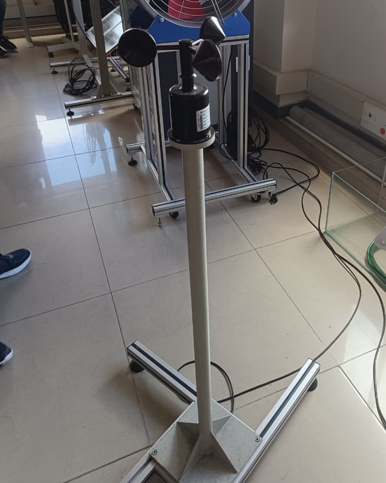

## Sensor de Temperatura PT100

Un sensor PT100 es un tipo de termorresistencia que se utiliza para medir temperatura basándose en la variación de la resistencia eléctrica de un elemento de platino al cambiar su temperatura. Su nombre proviene de “PT” por el platino y “100” porque a 0 °C presenta una resistencia de 100 ohmios. Este tipo de sensor es muy preciso, estable y reproducible, lo que lo hace ideal para aplicaciones industriales, científicas y de laboratorio. Funciona siguiendo el principio de que el platino aumenta su resistencia de forma casi lineal a medida que la temperatura sube, lo que permite obtener mediciones exactas en un rango que normalmente va desde −200 °C hasta 850 °C, dependiendo de su construcción.

**Características generales:**
- Rango de medición típico: -200 °C a 400 °C.
- Material sensor: Platino (Pt).
- Precisión: según clase (A, B, etc.).
- Salida: resistencia variable (no entrega voltaje directamente).
- Encapsulado: acero inoxidable, resistente a humedad y corrosión.

## Intel® RealSense™ Depth Camera D435

La cámara Intel RealSense D435 es un dispositivo de captura de profundidad diseñado para proporcionar información tridimensional del entorno en tiempo real. Utiliza un sistema de visión estéreo activo que combina dos sensores de imagen infrarrojos y un proyector de patrones IR para calcular con precisión la distancia a cada punto de la escena, incluso en condiciones de baja iluminación. Además, cuenta con una cámara de color RGB integrada, lo que le permite capturar simultáneamente imágenes en color y datos de profundidad, facilitando la creación de modelos 3D, el reconocimiento de objetos o el seguimiento de movimiento. Su diseño compacto y su capacidad para procesar datos rápidamente la hacen ideal para aplicaciones en robótica, visión por computadora, realidad aumentada y sistemas de navegación autónoma, donde la detección precisa del entorno es fundamental para la interacción segura y eficiente con el mundo físico.

## Sensor ultrasónico HC-SR04

El sensor ultrasónico HC-SR04 es un módulo muy utilizado en proyectos de electrónica, robótica y sistemas de automatización para medir distancias de manera precisa sin necesidad de contacto físico. Su funcionamiento se basa en el principio de la eco-localización: uno de sus transductores (marcado como Trig) emite una onda ultrasónica inaudible para los humanos, la cual viaja por el aire hasta chocar contra un objeto. Luego, el eco rebota y es captado por el segundo transductor (marcado como Echo). El módulo mide el tiempo transcurrido entre la emisión y la recepción de la señal, y a partir de la velocidad del sonido calcula la distancia al objeto. Este tipo de sensor es económico, fácil de integrar con microcontroladores como Arduino o Raspberry Pi, y ofrece una buena precisión en rangos cortos y medios, lo que lo hace ideal para aplicaciones como robots móviles, sistemas de medición de nivel y detección de obstáculos en entornos controlados.

- Rango de medición típico: 2 cm a 4 m.
- Precisión: Aproximadamente ±3 mm.
- Voltaje de operación: 5 V DC.
- Consumo de corriente: ~15 mA.

Aplicaciones comunes: Robots evitadores de obstáculos, medición de nivel de líquidos o sólidos, detección de proximidad, sistemas de conteo, automatización industrial y dispositivos interactivos.

## Anemometro

El anemómetro de cazoletas es un dispositivo empleado para medir la velocidad del viento en aplicaciones meteorológicas, experimentos en túneles de viento y proyectos de ingeniería. Su principio de funcionamiento se basa en la captación del viento por medio de tres (o a veces cuatro) cazoletas hemisféricas montadas sobre brazos horizontales que giran alrededor de un eje vertical. Cuando el viento incide sobre las cazoletas, la diferencia de arrastre entre el lado convexo y el cóncavo produce un giro continuo; este movimiento se transmite a un sistema de conteo o a un sensor electrónico que convierte la frecuencia de rotación en una lectura de velocidad.
Velocidad de medición típica: Desde unos pocos cm/s hasta más de 50 m/s, dependiendo del modelo.

- Aplicaciones comunes: Meteorología, pruebas en túneles de viento, calibración de sensores, estudios de aerodinámica.
- Ventajas: Sencillo, robusto y confiable incluso en condiciones exteriores.
- Limitaciones: Mide únicamente la velocidad del viento, no la dirección (para eso se combina con veletas).

