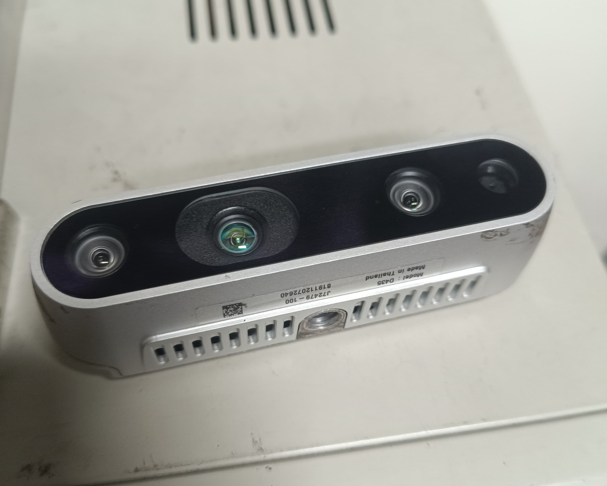

## Sensor de Temperatura PT100

Un sensor PT100 es un tipo de termorresistencia que se utiliza para medir temperatura basándose en la variación de la resistencia eléctrica de un elemento de platino al cambiar su temperatura. Su nombre proviene de “PT” por el platino y “100” porque a 0 °C presenta una resistencia de 100 ohmios. Este tipo de sensor es muy preciso, estable y reproducible, lo que lo hace ideal para aplicaciones industriales, científicas y de laboratorio. Funciona siguiendo el principio de que el platino aumenta su resistencia de forma casi lineal a medida que la temperatura sube, lo que permite obtener mediciones exactas en un rango que normalmente va desde −200 °C hasta 850 °C, dependiendo de su construcción.

**Características generales:**
- Rango de medición típico: -200 °C a 400 °C.
- Material sensor: Platino (Pt).
- Precisión: según clase (A, B, etc.).
- Salida: resistencia variable (no entrega voltaje directamente).
- Encapsulado: acero inoxidable, resistente a humedad y corrosión.

## Intel® RealSense™ Depth Camera D435

La cámara Intel RealSense D435 es un dispositivo de captura de profundidad diseñado para proporcionar información tridimensional del entorno en tiempo real. Utiliza un sistema de visión estéreo activo que combina dos sensores de imagen infrarrojos y un proyector de patrones IR para calcular con precisión la distancia a cada punto de la escena, incluso en condiciones de baja iluminación. Además, cuenta con una cámara de color RGB integrada, lo que le permite capturar simultáneamente imágenes en color y datos de profundidad, facilitando la creación de modelos 3D, el reconocimiento de objetos o el seguimiento de movimiento. Su diseño compacto y su capacidad para procesar datos rápidamente la hacen ideal para aplicaciones en robótica, visión por computadora, realidad aumentada y sistemas de navegación autónoma, donde la detección precisa del entorno es fundamental para la interacción segura y eficiente con el mundo físico.

