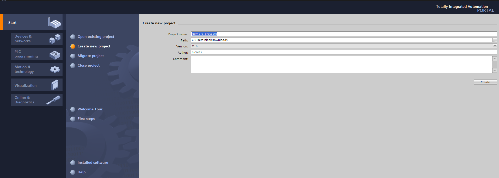
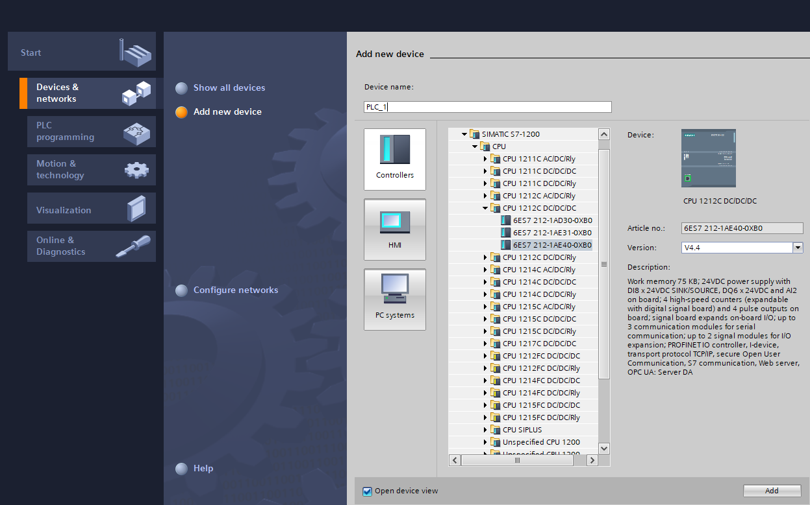
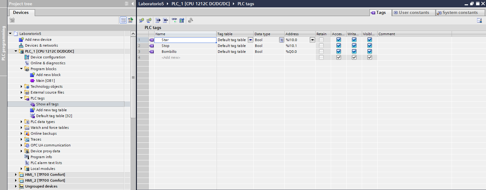
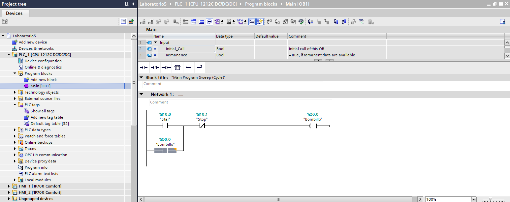
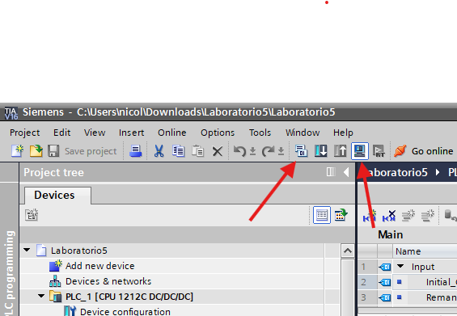
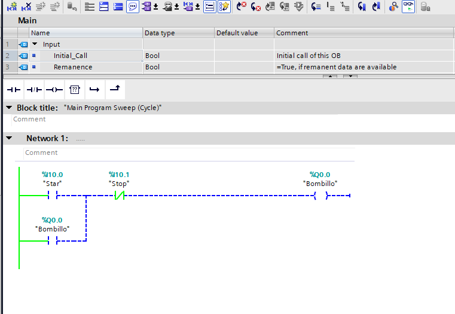

# Guía de instalación de TIA Portal V16

Esta guía explica paso a paso cómo instalar TIA Portal V16 en Windows.

## 1. Requisitos del sistema
- **Sistema operativo:** Windows 10 (64 bits) o superior.
- **RAM:** 8 GB mínimo (16 GB recomendado).
- **CPU:** Procesador de 64 bits.
- **Disco:** Aproximadamente 40 GB libres.
- **.NET Framework:** Versión 4.8 o superior.

## 2. Archivos necesarios
1. Imagen ISO o instalador oficial de **TIA Portal V16**.
2. Paquetes adicionales:
   - STEP 7
   - WinCC
   - StartDrive
   - Safety

## 3. Instalación
1. Abre el instalador `Start.exe` desde la carpeta raíz.
2. Selecciona **Install TIA Portal V16**.
3. Elige los módulos que deseas instalar (STEP 7, WinCC, etc).
4. Acepta los términos de Siemens.
5. Espera a que el instalador copie los archivos.
6. Cuando lo pida, reinicia el equipo.

## 4. Activación del software
1. Abre el **Automation License Manager**.
2. Importa la licencia que corresponda a tu versión.
3. Verifica que aparezca en verde y activa el producto.

## 5. Configuración inicial
1. Ejecuta **TIA Portal V16**.
2. Selecciona el idioma.
3. Actualiza paquetes si el software lo solicita.

## 6. Resolución de problemas comunes
- **Mensaje de falta de .NET Framework:** instala la versión 4.8.
- **Error por drivers:** ejecuta el instalador como administrador.
- **Interfaz bloqueada:** revisa que Windows Defender no haya bloqueado componentes.

------------

# Lenguaje Ladder

El lenguaje Ladder(también llamado *Ladder Diagram* o *diagrama de escalera*) es un lenguaje de programación utilizado en la automatización industrial para programar Controladores Lógicos Programables (PLC). Su diseño imita los diagramas de relés eléctricos, lo que facilita que técnicos e ingenieros que vienen del mundo eléctrico puedan entender y crear lógicas sin necesidad de aprender un lenguaje textual complejo.

## ¿Por qué se llama “Ladder”?

El programa se representa como una **escalera**:

- Dos líneas verticales representan la **alimentación** (L y N o + y −).
- Entre ellas se dibujan “peldaños”, que son las **lógicas de control**.
- Cada peldaño es una instrucción que evalúa condiciones y activa salidas.

Visualmente, cada peldaño se parece a un circuito de contactos y bobinas.

## Qué elementos básicos tiene

### 1. **Contactos**
Simulan contactos eléctricos.

- **Normalmente abierto (NO)**: deja pasar la señal cuando la condición es verdadera.  
- **Normalmente cerrado (NC)**: deja pasar cuando la condición es falsa.

### 2. **Bobinas (Coils)**
Representan salidas o marcas internas.  
Cuando la lógica del peldaño se cumple, la bobina se activa.

### 3. **Temporizadores y contadores**
Permiten medir tiempo, contar eventos o generar retardos.

### 4. **Bloques funcionales**
Operaciones más complejas como comparaciones, bloques matemáticos o funciones del PLC.

## ¿Cómo funciona la lógica?

Un PLC ejecuta los peldaños de arriba hacia abajo, evaluando cada uno en cada ciclo de escaneo.  
Si las condiciones del peldaño se cumplen, la salida asociada cambia de estado.

## Ventajas del lenguaje Ladder

- Muy visual y fácil de entender.  
- Ideal para lógica combinacional y secuencial sencilla.  
- Excelente para diagnóstico: el PLC muestra qué contactos están activos en tiempo real.  
- Estándar en la industria (IEC 61131-3).

# Simulacion enganche de Bombilla
## Creacion del proyecto
- Iniciar TIA Portal

- Seleccionar crear proyecto y seguir las instrucciones

- Una vez el proyecto este creado, en panel de la izquierda seleccionar redes y dispositivos para seleccionar la CPU del PLC a utilizar

## Componentes
Dirigirse a la seccion de PLC Tags y añadir los siguietnes Tags:
- Boton normalmente abierto: Start
- Boton normalmente cerrado: Stop
- Salida: Bombillo

## Creacion del Programa
- Abrir el bloque de programa 'Main[OB1]'
- Añadir los siguientes bloques y poner las etiquetas de entradas y salidas

## Simulacion
- Para simular el proyecto primero debe compilarse con el boton a la izquierda de la imagen y el de la derecha para iniciar la simulacion

- Luego aparecera una ventana par confirmar la subida del programa al PLC de la simulacion donde simplemente presionaremos cargar

- Por ultimo en la ventana de PLC SIM presionaremos RUN. Para visualizar y editar las variables (Entradas y salidas) presionaremos el boton con unas gafas y simbolo de reproducir

- Cuando los colores del diagrama ladder cambien ya podremos cambiar las variables de entrada y observar el cambio en la salidas

