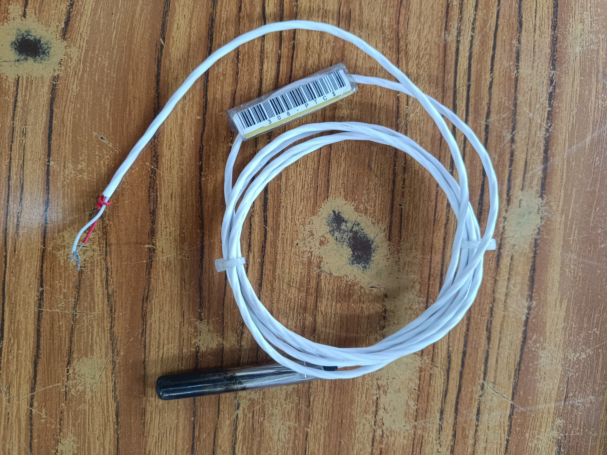

# Comunicaciones industriales

## Sensor de Temperatura PT100

El **PT100** es un sensor de temperatura del tipo **RTD** (Resistance Temperature Detector) que utiliza una resistencia de platino cuyo valor cambia de forma predecible con la temperatura. El "100" indica que la resistencia es de **100 Ω a 0 °C**.

Este modelo está encapsulado en una **sonda de acero inoxidable** para mayor protección y cuenta con cableado extendido. Puede tener 2, 3 o 4 hilos (este es de 2 hilos) y se usa comúnmente en aplicaciones industriales y científicas por su **alta precisión y estabilidad**.

**Características generales:**
- Rango de medición típico: -200 °C a 400 °C.
- Material sensor: Platino (Pt).
- Precisión: según clase (A, B, etc.).
- Salida: resistencia variable (no entrega voltaje directamente).
- Encapsulado: acero inoxidable, resistente a humedad y corrosión.

